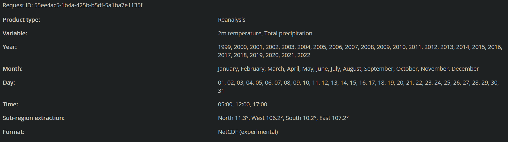

**Knitted at: `r Sys.time()`**

# Library

```{r message=FALSE, warning=FALSE}
library(tidyverse)
library(magrittr)

library(feasts)
library(tsibble)
library(fable.prophet)
library(fabletools)
library(fable)

library(lubridate)

library(ggdist)

library(sf)
library(stars)
```

```{r}
theme_set(theme_bw())
```

## Incidence data

```{r}
ggplot(incidence_weekly_df, aes(x = date_admitted, y = n)) +
  geom_line()
```

## HCMC shape

```{r}
ggplot() +
  geom_sf(data = hcmc_shp_w_buff) +
  geom_sf(data = hcmc_shp)
```

## Weather data

Data information: 
```{r}
raw_weather
```

### Temperature data

```{r}
hcmc_temp_df %>%
  ggplot(aes(x = date, y = t2m)) +
  geom_line() +
  geom_smooth() +
  scale_x_yearweek("Week") +
  scale_y_continuous("2m temperature") +
  ggtitle("Weekly 2m temperature ERA5 reanalysis")

ggsave("weekly_t2m_ts.svg", width = 10, height = 7)

hist(hcmc_temp_df$t2m)

hist(hcmc_temp_df$scaled_t2m)
```

### Precipitation data

```{r}
hcmc_precip_df %>%
  ggplot(aes(x = date, y = precip)) +
  geom_line() +
  geom_smooth() +
  scale_x_yearweek("Week") +
  scale_y_continuous("Total precipitation") +
  ggtitle("Weekly Total precipitation ERA5 reanalysis")

ggsave("weekly_precip_ts.svg", width = 10, height = 7)

hist(hcmc_precip_df$precip)
hist(hcmc_precip_df$scaled_precip)
```

```{r}
incidence_weekly_weather_df
```

# Correlation analysis

## CCF

"The lag k value returned by ccf(x, y) estimates the correlation between x[t+k] and y[t]."

```{r}
incidence_weekly_weather_df %>%
  CCF(n, t2m, lag_max = 52) %>%
  autoplot()

incidence_weekly_weather_df %>%
  mutate(t2m_lagged = lag(t2m, 27)) %>%
  filter(year(date_admitted) < 2019) %>%
  CCF(n, t2m_lagged, lag_max = 52) %>%
  autoplot()

incidence_weekly_weather_df %>%
  CCF(n, precip, lag_max = 52) %>%
  autoplot()

incidence_weekly_weather_df %>%
  mutate(precip_lagged = lag(precip, 10)) %>%
  filter(year(date_admitted) < 2019) %>%
  CCF(n, precip_lagged, lag_max = 52) %>%
  autoplot()

incidence_weekly_weather_df %>%
  CCF(n, date_admitted, lag_max = 52) %>%
  autoplot()
```

```{r}
train_weekly_weather_df <- incidence_weekly_weather_df %>%
  mutate(
    t2m_lagged = lag(t2m, 27),
    precip_lagged = lag(precip, 10)
  ) %>%
  filter_index("2000 W01" ~ "2018 W52")

test_weekly_weather_df <- incidence_weekly_weather_df %>%
  mutate(
    t2m_lagged = lag(t2m, 27),
    precip_lagged = lag(precip, 10)
  ) %>%
  filter(year(date_admitted) == 2019) %>%
  head(4)
```

# Modelling

## Performance checking framework

```{r}
fit_perf <- function(fit, actual) {
  print(summary(fit))

  fitted <- fitted(fit)

  fitted %>% plot(type = "l")

  print(sprintf(
    "Train RMSE: %f",
    sqrt(mean((actual - fitted)^2))
  ))
  print(sprintf(
    "Train MAE: %f",
    mean(abs(actual - fitted))
  ))

  print(train_weekly_weather_df %>%
    mutate(fitted = fitted) %>%
    ggplot(aes(x = date_admitted)) +
    geom_line(aes(y = n)) +
    geom_line(aes(y = fitted), color = "red"))
}

model_perfs <- tibble(
  model = character(),
  RMSE = numeric(),
  MAE = numeric()
)

forecast_perf <- function(forecast, actual, model_name) {
  forecast %>% plot(type = "l")

  rmse <- sqrt(mean((actual - forecast)^2))
  mae <- mean(abs(actual - forecast))

  print(sprintf("Test RMSE: %f", rmse))
  print(sprintf("Test MAE: %f", mae))

  model_perfs <<- model_perfs %>% bind_rows(tibble(model = model_name, RMSE = rmse, MAE = mae))

  print(test_weekly_weather_df %>%
    mutate(forecast = forecast) %>%
    ggplot(aes(x = date_admitted)) +
    geom_line(aes(y = n)) +
    geom_line(aes(y = forecast), color = "red"))
}
```


## Poisson

```{r}
poisson_fit <- glm(
  n ~ date_admitted + scaled_t2m + scaled_precip,
  family = poisson(), data = train_weekly_weather_df
)

fit_perf(poisson_fit)

poisson_forecast <- predict(poisson_fit, newdata = incidence_2019_weekly_df)

forecast_perf(poisson_forecast)
```

```{r}
nb_fit <- MASS::glm.nb(
  n ~ date_admitted + scaled_t2m + scaled_precip,
  data = train_weekly_weather_df
)

fit_perf(nb_fit)


nb_forecast <- predict(nb_fit, newdata = incidence_2019_weekly_df)

forecast_perf(nb_forecast)
```
